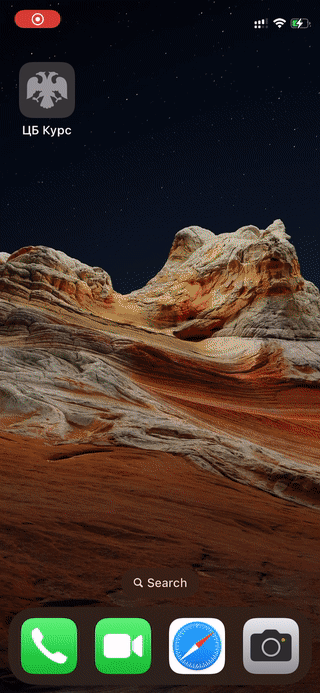
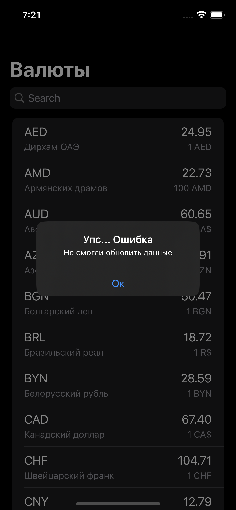

# [SBER] ExchangeRates
Устаревшое тестовое задание от Сбер по созданию приложения отображающего курсы валют ЦБ.

## Стек
SwiftUI, MVVM, Coordinators, SPM 

## Примеры

### Успешный путь

### Ошибки

    
    

## Первый запуск
1. Установить [`SwiftLint`](https://github.com/realm/SwiftLint)
2. Запустить проект