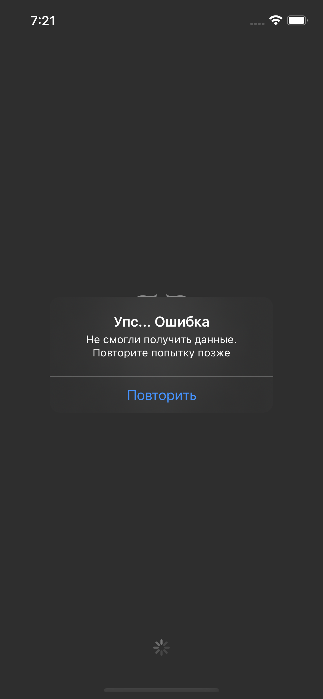

# [SBER] ExchangeRates
Устаревшое тестовое задание от Сбер по созданию приложения отображающего курсы валют ЦБ.

## Стек
SwiftUI, MVVM, Coordinators, SPM, R.swift, SwiftyMocky, Nimble 

## Примеры

### Успешный путь


### Ошибки
<p float="left">
    
    
</p>

## Первый запуск
1. Установить [`SwiftLint`](https://github.com/realm/SwiftLint)
2. Установить [`SwiftyMocky`](https://github.com/MakeAWishFoundation/SwiftyMocky)
3. Сгенерировать моки, указав путь до папки с модулями:
```sh
./Scripts/mock_gen.sh ./Modules/
```
4. Запустить проект
5. Дождаться завершения установки пакетов